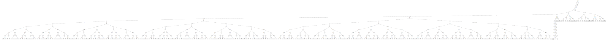

# Huffman table hacking tool


This tool calculates tricky canonical huffman histogram, which is able to trigger OOB (Out Of Bound) write for vulnerable libwebp library (i.e. libwebp <= `1.3.1`). This vulnerability is known as `CVE-2023-4863`. We can overflow the pre-allocated huffman table by  at most **128 entries**.


The rationale is that libwebp assumes the huffman histogram contained in each webp image is well formated, which means that the resulted decoding tree must be a **complete tree**. With this assumption, libwebp group took advantage of a tool [enough](https://github.com/madler/zlib/blob/develop/examples/enough.c) to estimate the maximum memory required to build the decoding huffman table (a powerful structure to decode canonical huffman codes rapidly). However, hackers are able to construct an **incomplete** tree to go beyond this memory limit and thus overflow the pre-allocated memory.


Compile the code using command below:


```bash
gcc -o NotEnough ./main.c
```


For a huffman table with 40-symbol, 8-bit root table and maximum depth being 15, the maximum number of table entries is `410`. However, by constructing an incomplement tree, the number of table entries could be `538`. Try the command below:


```bash
./NotEnough 40 8 15
```


An example of such trees is as below:





 You can then use this tool named [craft](https://github.com/mistymntncop/CVE-2023-4863) to construct an effective webp image to overflow **dwebp** tool (version <= `1.3.1`). Change the huffman code histogram **code_lengths_counts[4]** to {0, 1, 1, 1, 1, 0, 0, 0, 0, 27, 1, 1, 1, 1, 1, 4} accordingly, and rebuild the tool:


```bash
vim craft.c    # Change huffman code histogram accordingly, i.e. about line 495.
gcc -o craft craft.c
./craft -o bad_538.webp
```


Please check [@benhawkes's blog](https://blog.isosceles.com/the-webp-0day/) to have a better idea of `CVE-2023-4863`.


